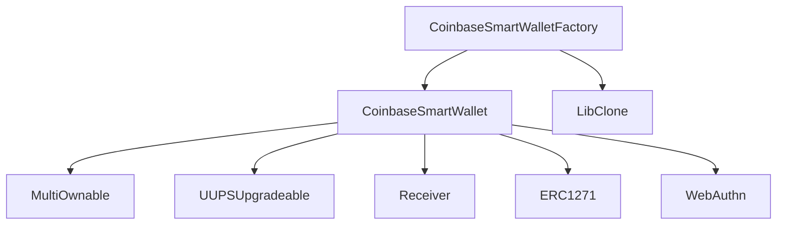

## Coinbase Smart Wallet Conceptual Overview:
The Coinbase Smart Wallet is a decentralized, Ethereum-compatible smart contract wallet designed to provide users with a secure, flexible, and user-friendly solution for managing their digital assets and interacting with decentralized applications (dApps). It leverages the security and programmability of smart contracts to offer advanced features and enhanced user control over their funds.

**System Overview:**
The Coinbase Smart Wallet consists of several key components:

1. Smart Contract Wallet: The core component of the system is a smart contract deployed on the Ethereum blockchain that represents the user's wallet. It holds the user's assets and defines the rules and permissions for accessing and managing those assets.

2. MultiOwnable: A module that enables multiple owners to control the wallet. It allows for the addition and removal of owners and requires a predefined number of owner signatures to execute certain actions, enhancing security and preventing single points of failure.

3. ERC4337 Compliance: The wallet is compliant with the ERC4337 standard, which defines a set of interfaces and conventions for smart contract wallets. This compliance ensures interoperability with other ERC4337-compatible systems and wallets.

4. WebAuthn Integration: The wallet integrates with the WebAuthn standard for secure user authentication. It allows users to authenticate using hardware devices, such as security keys or biometric sensors, providing an additional layer of security.

5. Coinbase Smart Wallet Factory: A factory contract that facilitates the creation of new wallet instances. It streamlines the deployment process and ensures that each wallet is properly initialized with the necessary configurations and permissions.

**Breakdown of Functions:**
1. Asset Management: Users can securely store, receive, and transfer various digital assets, such as Ethereum and ERC20 tokens, using the Coinbase Smart Wallet. The wallet provides functions for depositing, withdrawing, and transferring assets.

2. Access Control: The MultiOwnable module enables granular access control over the wallet's functions. It allows for the designation of multiple owners, each with their own set of permissions. Owners can be added or removed, and certain actions require a predefined number of owner signatures.

3. Transaction Execution: The wallet supports the execution of arbitrary transactions, including interactions with other smart contracts and dApps. Users can initiate transactions, and the wallet enforces the necessary access controls and permissions.

4. WebAuthn Authentication: The integration with WebAuthn enables secure user authentication using hardware devices. Users can register their devices and use them to sign transactions and authorize actions, providing an additional layer of security.

5. Recovery Mechanisms: The wallet implements recovery mechanisms to protect against the loss of private keys or the compromise of owner accounts. It may include features like social recovery, where a predefined set of trusted individuals can help recover access to the wallet.

**Roles in the System:**
1. Wallet Owners: The individuals or entities who have been designated as owners of the Coinbase Smart Wallet. They have the authority to perform certain actions, such as adding or removing other owners and executing transactions.

2. Users: The end-users who interact with the Coinbase Smart Wallet to manage their digital assets and engage with dApps. They can initiate transactions, deposit and withdraw funds, and authenticate using WebAuthn-compatible devices.

3. Developers: The developers who build and deploy smart contracts and dApps that interact with the Coinbase Smart Wallet. They can leverage the wallet's features and ERC4337 compliance to create secure and user-friendly experiences.

**Architecture and Workflow:**
1. Wallet Creation: A user interacts with the Coinbase Smart Wallet Factory to deploy a new wallet instance. The factory initializes the wallet with the necessary configurations and permissions.

2. Ownership Assignment: The user becomes the initial owner of the wallet and can add additional owners using the MultiOwnable module. Each owner is assigned a set of permissions and can perform actions based on their assigned roles.

3. Asset Management: Users can deposit assets into the wallet, transfer assets to other addresses, and withdraw assets from the wallet. The wallet enforces access controls and permissions to ensure that only authorized owners can perform these actions.

4. Transaction Execution: Users can initiate transactions through the wallet, including interactions with other smart contracts and dApps. The wallet verifies the necessary signatures and permissions before executing the transactions.

5. WebAuthn Authentication: Users can register their WebAuthn-compatible devices with the wallet. When performing sensitive actions, such as transaction signing, users authenticate using their registered devices, providing an additional layer of security.

6. Recovery Mechanisms: In the event of lost private keys or compromised owner accounts, the wallet's recovery mechanisms can be triggered. This may involve a social recovery process where a predefined set of trusted individuals collaborate to restore access to the wallet.

The Coinbase Smart Wallet aims to provide users with a secure, flexible, and user-friendly solution for managing their digital assets and interacting with the decentralized ecosystem. By leveraging smart contract capabilities, multi-ownership, ERC4337 compliance, and WebAuthn integration, the wallet offers enhanced security, programmability, and interoperability.

## Architecture Overview <a name="architecture-overview"></a>

### Contract Interactions <a name="contract-interactions"></a>
The Coinbase Smart Wallet system consists of several key contracts and libraries that interact with each other to provide the desired functionality. The main contracts and their interactions are as follows:



- `CoinbaseSmartWallet`: The main contract that represents the smart wallet. It inherits from `MultiOwnable`, `UUPSUpgradeable`, `Receiver`, and `ERC1271`.
- `MultiOwnable`: A contract that manages multiple owners and provides access control functionality.
- `UUPSUpgradeable`: A contract that enables upgradeability using the UUPS (Universal Upgradeable Proxy Standard) pattern.
- `Receiver`: A contract that provides a safe way to receive Ether transfers.
- `ERC1271`: A contract that implements the ERC-1271 standard for signature validation.
- `WebAuthn`: A library that provides WebAuthn authentication functionality.
- `CoinbaseSmartWalletFactory`: A factory contract that deploys new instances of the `CoinbaseSmartWallet` contract.
- `LibClone`: A library that provides functions for creating clones of contracts.

### Architecture Risks and Recommendations <a name="architecture-risks-and-recommendations"></a>
1. Complexity: The smart wallet system involves multiple contracts and libraries, which can increase the overall complexity and potential attack surface. It is recommended to keep the architecture as modular and simple as possible, and thoroughly test all interactions between components.

2. Upgradability: The use of the UUPS pattern for upgradeability introduces the risk of potential vulnerabilities in the upgrade process. It is crucial to ensure that only authorized parties can initiate upgrades and that the upgrade mechanism is secure and well-tested.

3. External Dependencies: The system relies on external libraries and contracts, such as Solady and OpenZeppelin. It is important to regularly review and update these dependencies to ensure they are secure and free from known vulnerabilities.

4. Access Control: The `MultiOwnable` contract allows multiple owners to manage the smart wallet. While this provides flexibility, it also introduces risks if any of the owners' private keys are compromised. Implement strong access control mechanisms and consider requiring multiple signatures for critical operations.

## Codebase Quality Analysis <a name="codebase-quality-analysis"></a>

### Code Organization and Readability <a name="code-organization-and-readability"></a>
The codebase follows a modular structure, with contracts and libraries organized into separate files based on their functionality. The code is well-commented, and the naming conventions used for variables, functions, and contracts are clear and descriptive. This enhances the readability and maintainability of the codebase.

**However, there are a few instances where the code could be further improved:**

- Some functions, such as `executeWithoutChainIdValidation` and `executeBatch`, have a high level of complexity and could benefit from additional comments or documentation explaining their purpose and logic.
- The use of inline assembly in certain parts of the code, such as in the `MultiOwnable` contract, can make the code harder to understand and audit. Consider providing clear comments or documentation explaining the purpose and functionality of the assembly code.

### Use of Libraries and Dependencies <a name="use-of-libraries-and-dependencies"></a>
The Coinbase Smart Wallet system makes use of several external libraries and dependencies, including:

- Solady: A library that provides various utility functions and contracts, such as `Receiver`, `UUPSUpgradeable`, and `LibClone`.
- OpenZeppelin: A widely-used library that provides secure and tested implementations of common smart contract patterns and functionalities.

The use of these reputable libraries helps to reduce the risk of vulnerabilities and ensures that the codebase follows best practices. However, it is important to regularly review and update these dependencies to ensure they are up to date and free from known security issues.

### Error Handling and Validation <a name="error-handling-and-validation"></a>
The codebase includes appropriate error handling and validation mechanisms to prevent unexpected behavior and protect against potential attacks. Some examples include:

- The use of custom errors, such as `Unauthorized`, `AlreadyOwner`, and `Expired`, to provide clear and specific error messages when certain conditions are not met.
- Input validation in functions like `addOwnerAddress`, `removeOwnerAtIndex`, and `validateUserOp` to ensure that the provided arguments are valid and within expected ranges.
- Checks for zero addresses and empty byte arrays to prevent common edge cases and errors.

However, there are a few areas where additional validation could be considered:

- In the `MultiOwnable` contract, the `removeOwnerAtIndex` function allows removing an owner at a specific index. Consider adding a check to ensure that the contract always has at least one owner remaining to prevent accidentally removing all owners and rendering the contract inaccessible.
- In the `CoinbaseSmartWallet` contract, the `execute` and `executeBatch` functions allow executing arbitrary low-level calls to external contracts. While these functions are protected by the `onlyEntryPointOrOwner` modifier, it is important to carefully validate and sanitize the input data to prevent potential vulnerabilities or unintended behavior.

### Gas Optimization <a name="gas-optimization"></a>
The codebase demonstrates efforts to optimize gas usage and improve efficiency. Some examples include:

- The use of the `callWithMinGas` function from the `CallLib` library in the `execute` function to ensure that the called target has sufficient gas to execute its logic without running out of gas.
- The use of the `unchecked` block in the `executeBatch` function to avoid unnecessary overflow checks when incrementing the loop counter, as the loop is bounded by the length of the `calls` array.
- The use of the `immutable` keyword for the `implementation` variable in the `CoinbaseSmartWalletFactory` contract to save gas by avoiding storage reads.

However, there may be opportunities for further gas optimization, such as:

- Considering the use of the `payable` keyword for functions that do not need to receive Ether, as it can save gas compared to non-payable functions.
- Reviewing the use of storage variables and considering packing them into fewer storage slots to reduce gas costs.
- Analyzing the gas usage of frequently called functions and exploring potential optimizations, such as reducing the number of external calls or using more efficient data structures.

## Centralization Risks and Admin Control <a name="centralization-risks-and-admin-control"></a>

### Contract Ownership <a name="contract-ownership"></a>
The Coinbase Smart Wallet system utilizes a multi-ownership model, where multiple owners can be added to the smart wallet contract. While this provides flexibility and allows for shared control, it also introduces centralization risks if the owners are not carefully managed.

- The `MultiOwnable` contract allows any current owner to add or remove other owners using the `addOwnerAddress`, `addOwnerPublicKey`, and `removeOwnerAtIndex` functions. This means that a single compromised owner could potentially add malicious owners or remove all other owners, effectively taking control of the smart wallet.
- The `CoinbaseSmartWalletFactory` contract has an `immutable` `implementation` variable that points to the address of the deployed `CoinbaseSmartWallet` contract. This address is set during the factory contract's deployment and cannot be changed afterward. If the implementation contract contains vulnerabilities or needs to be updated, a new factory contract would need to be deployed.

To mitigate these risks, consider implementing additional safeguards, such as:

- Requiring multiple owner signatures or approvals for critical operations, such as adding or removing owners.
- Implementing time locks or delays for owner management functions to prevent sudden changes and allow for community review.
- Regularly rotating owner keys and monitoring owner activity to detect and prevent unauthorized actions.

### Admin Functions and Privileges <a name="admin-functions-and-privileges"></a>
The Coinbase Smart Wallet system provides certain admin functions and privileges to the contract owners. These functions allow owners to perform actions such as adding or removing other owners, upgrading the contract implementation, and executing arbitrary low-level calls.

- The `addOwnerAddress`, `addOwnerPublicKey`, and `removeOwnerAtIndex` functions in the `MultiOwnable` contract allow owners to manage the set of owners for the smart wallet. While these functions are protected by the `onlyOwner` modifier, they still grant significant power to the owners and could potentially be abused if an owner's private key is compromised.
- The `_authorizeUpgrade` function in the `UUPSUpgradeable` contract allows owners to upgrade the contract implementation. While this provides flexibility for fixing bugs or adding new features, it also introduces the risk of upgrading to a malicious or vulnerable implementation.
- The `execute` and `executeBatch` functions in the `CoinbaseSmartWallet` contract allow owners to execute arbitrary low-level calls to external contracts. While these functions are useful for interacting with other contracts and protocols, they also pose a risk if the external contracts are malicious or contain vulnerabilities.

To mitigate these risks, consider implementing the following measures:

- Implement multi-signature requirements for admin functions, requiring multiple owners to approve critical actions.
- Conduct thorough code reviews and audits before deploying any upgrades or changes to the contract implementation.
- Carefully validate and sanitize input data for the `execute` and `executeBatch` functions to prevent potential vulnerabilities or unintended behavior.
- Implement emergency stop mechanisms or circuit breakers that can be triggered by a designated subset of owners in case of security breaches or unexpected behavior.

### Upgrade Mechanism <a name="upgrade-mechanism"></a>
The Coinbase Smart Wallet system utilizes the UUPS (Universal Upgradeable Proxy Standard) pattern for contract upgradeability. While this pattern provides flexibility for fixing bugs and adding new features, it also introduces potential risks if not implemented and managed correctly.

- The `UUPSUpgradeable` contract allows owners to upgrade the contract implementation using the `_authorizeUpgrade` function. If this function is not properly protected or if the upgrade process is not thoroughly tested, it could lead to the introduction of vulnerabilities or unexpected behavior in the new implementation.
- The `CoinbaseSmartWalletFactory` contract deploys new instances of the `CoinbaseSmartWallet` contract using the `implementation` address. If the implementation contract is upgraded to a malicious or vulnerable version, all new smart wallets deployed by the factory will inherit those issues.

To mitigate these risks, consider the following recommendations:

- Implement a robust governance mechanism for contract upgrades, involving multiple stakeholders and requiring consensus before executing any upgrades.
- Conduct thorough testing and auditing of any new contract implementations before deploying them, including both functional testing and security analysis.
- Consider implementing a time lock or delay mechanism for contract upgrades to allow for community review and potential objections before the upgrade takes effect.
- Regularly monitor the contract's behavior and performance after upgrades to detect any anomalies or unexpected issues.

### I've examined the SmartWallet codebase and here are my findings related to unauthorized fund movement:

Functions that can move funds out of the SmartWallet account:
- `execute(address target, uint256 value, bytes calldata data)`: This function can transfer funds to any target address. It is restricted by the `onlyEntryPointOrOwner` modifier.
- `executeBatch(Call[] calldata calls)`: This function can transfer funds to multiple target addresses in batches. It is also restricted by the `onlyEntryPointOrOwner` modifier.

**Access control for fund transfers:**
- Both the `execute` and `executeBatch` functions are protected by the `onlyEntryPointOrOwner` modifier. 
- This modifier checks that the caller is either the EntryPoint contract or one of the current owners of the SmartWallet. It does this by calling `isOwnerAddress(msg.sender)` and comparing `msg.sender` to `entryPoint()`.
- The `isOwnerAddress` function looks up the owner in the `isOwner` mapping which is managed by the `addOwner` and `removeOwner` functions. These are in turn protected by the `onlyOwner` modifier.
- So in summary, fund transfers can only be initiated by the EntryPoint or a current owner, and owner management is also restricted to current owners only. The access control logic seems to be implemented correctly.

**Potential bypasses:**
- One bypass to consider is if the EntryPoint address is somehow manipulated. The `entryPoint()` function returns a hardcoded address - if this address were to change or be a false contract, it might open the door for unauthorized transfers. However, the hardcoded address seems to be the correct v0.6 EntryPoint.
- Another potential issue is if the owner's private key or an owner passkey is compromised. This would allow the attacker to become an owner and make arbitrary transfers. Key/passkey security on the owner's side is paramount.
- Apart from these, I don't see any ways in the SmartWallet code itself for an attacker to bypass the `onlyEntryPointOrOwner` checks. The modifiers are used consistently.

**Interactions with external contracts:**
- `execute` and `executeBatch` allow arbitrary low-level calls to any contract address. If the target contract has a vulnerability or malicious code, it could potentially drain funds from the SmartWallet when called.
- However, since only the EntryPoint or current owners can call `execute`/`executeBatch` in the first place, the risk is somewhat mitigated. It would require the owner to intentionally execute a malicious transfer.
- The use of `CallLib.callWithMinGas` in `execute` does prevent attacks where the called target intentionally runs out of gas and reverts the transfer while still consuming the SmartWallet's balance.

### Here's an analysis of the state-changing functions in the SmartWallet contract and their potential impact on account bricking:

State-changing functions:
1. `initialize(bytes[] calldata owners)`: 
   - Initializes the contract state with the given owner list.
   - Can only be called once when NextOwnerIndex is 0. 
   - Modifies `NextOwnerIndex` and `isOwner` mappings.
   - Low risk of bricking as it can only be called during contract deployment.

2. `addOwnerAddress(address owner)`, `addOwnerPublicKey(bytes32 x, bytes32 y)`: 
   - Adds a new owner address or public key to the SmartWallet.
   - Protected by `onlyOwner` modifier, so only existing owners can call it.
   - Modifies `NextOwnerIndex`, `isOwner` and `ownerAtIndex` mappings.
   - Low risk of bricking as it only adds new owners and is controlled by existing owners.

3. `removeOwnerAtIndex(uint256 index)`:
   - Removes an owner at the given owner index.
   - Protected by `onlyOwner` modifier.
   - Modifies `isOwner` and `ownerAtIndex` mappings.
   - Potential bricking risk if all owners are removed, making the wallet inaccessible. Careful use under owner control is required.

4. `_authorizeUpgrade(address newImplementation)`:
   - Authorizes an implementation upgrade for the proxy contract.
   - Protected by `onlyOwner` modifier.
   - Doesn't directly modify state, but enables contract upgrades.
   - Potential bricking risk if a malicious or bugged implementation is authorized. Careful review by owners before upgrade is critical.

5. `execute(address target, uint256 value, bytes calldata data)`, `executeBatch(Call[] calldata calls)`:
   - Executes arbitrary contract calls, including state modifications.
   - Protected by `onlyEntryPointOrOwner` modifier.
   - Potential bricking risk if malicious or bugged contract calls are made that lock up the wallet state or funds.

**Account manipulation and recovery:**
- The most critical functions that could brick the account are `removeOwnerAtIndex` (by removing all owners) and `_authorizeUpgrade` (by deploying a malicious implementation).
  
- However, both are protected by the `onlyOwner` modifier, so they can only be called by the current owners. As long as one non-malicious owner remains, they can add back other owners or upgrade to a fixed implementation to recover the wallet.

- The initialize function is safely restricted to only be callable once.

- For `execute`/`executeBatch`, the risk depends on the contracts being called. Malicious calls could potentially brick the state, but again, only owners or the trusted EntryPoint can initiate these calls.

- In terms of recovery, since the SmartWallet uses a proxy pattern, the owners can always upgrade to a new implementation to fix any bugs or recover from a bricked state, as long as at least one owner remains to authorize the upgrade.

- One recommendation I have might be to enforce a minimum number of owners (e.g., always have at least 2-3) to prevent a single malicious or compromised owner from bricking the wallet.

### I've analyzed the `executeWithoutChainIdValidation` function and its related usage in the SmartWallet contract. Here are my findings:

`executeWithoutChainIdValidation` function:
- This function is intended to allow certain operations to be replayed across different chains without validating the chain ID.
- It takes the `UserOperation` calldata as input and checks if the first four bytes match the specific selector `0xbf6ba1fc`.
- If the selector matches, it calculates the `userOpHash` without including the chain ID, and validates that the `UserOperation`'s `nonce` key is `REPLAYABLE_NONCE_KEY`.
- If the selector doesn't match, it reverts if the `UserOperation`'s `nonce` key is `REPLAYABLE_NONCE_KEY`, to prevent non-replayable operations from using this key.
- The function then calls `_validateSignature` to verify the user's signature on the `userOpHash`.
- If the signature is valid, it calls the internal `_call` function to execute the operation.

`canSkipChainIdValidation` whitelist:
- This function is a pure function that returns a boolean indicating whether a given function selector is allowed to skip chain ID validation.
- The whitelist currently includes the following selectors:
  - `MultiOwnable.addOwnerPublicKey`
  - `MultiOwnable.addOwnerAddress`
  - `MultiOwnable.removeOwnerAtIndex`
  - `UUPSUpgradeable.upgradeToAndCall`
- The `executeWithoutChainIdValidation` function checks this whitelist by calling `canSkipChainIdValidation` with the first four bytes of the calldata.
- If the selector is not in the whitelist, the function reverts with a custom error `SelectorNotAllowed`.

Cross-chain replay risks and impacts:
- The functions in the whitelist are related to managing owners of the SmartWallet (adding/removing) and upgrading the implementation contract.
- Replaying these functions across chains could allow synchronizing the owner list and contract implementation across multiple chains where the SmartWallet is deployed.
- However, there are some potential risks to consider:
  - If the chains have different validation rules or constraints around owner operations or upgrades, replaying these functions might violate those rules on some chains.
  - If the owner keys or upgrade authorization is compromised on one chain, the attacker could replay those malicious operations to other chains, potentially taking over the SmartWallet on all chains.
  - Chains might have different gas costs for the same operations, so a replay transaction that succeeds on one chain might fail on another chain due to insufficient gas.
- To mitigate these risks, it's important to:
  - Carefully consider which functions absolutely need cross-chain replay and keep the whitelist minimal.
  - Ensure that the replayed functions have consistent validation logic across all target chains.
  - Implement additional checks or constraints in the replayed functions themselves to prevent abuse if needed.
  - Monitor replay transactions closely and have a plan to quickly pause or stop replays if malicious activity is detected.

### I've reviewed the implementation and usage of the `onlyOwner`, `onlyEntryPoint`, and `onlyEntryPointOrOwner` modifiers in the SmartWallet contract. Here's my analysis:

`onlyOwner` modifier:
- This modifier is defined in the `MultiOwnable` contract.
- It calls the internal `_checkOwner` function to verify that the caller is a current owner.
- The `_checkOwner` function checks if the caller is an owner by calling `isOwnerAddress(msg.sender)` or if the caller is the SmartWallet contract itself.
- If the caller is not an owner, it reverts with the custom error `Unauthorized`.
- The modifier is applied to the following functions:
  - `addOwnerAddress`
  - `addOwnerPublicKey`
  - `removeOwnerAtIndex`
  - `_authorizeUpgrade` (from `UUPSUpgradeable`)
- The usage of the `onlyOwner` modifier for these functions is appropriate, as they are sensitive operations that should only be accessible to current owners.

`onlyEntryPoint` modifier:
- This modifier is defined in the `SmartWallet` contract.
- It checks if the caller is the EntryPoint contract by comparing `msg.sender` to the result of the `entryPoint()` function.
- If the caller is not the EntryPoint, it reverts with the custom error `Unauthorized`.
- The modifier is applied to the following functions:
  - `validateUserOp`
  - `executeWithoutChainIdValidation`
- The usage of the `onlyEntryPoint` modifier for these functions is appropriate, as they are operations that should only be callable by the EntryPoint contract.

`onlyEntryPointOrOwner` modifier:
- This modifier is defined in the `SmartWallet` contract.
- It first checks if the caller is the EntryPoint by comparing `msg.sender` to the result of the `entryPoint()` function.
- If the caller is not the EntryPoint, it calls the `_checkOwner` function to verify that the caller is a current owner.
- The modifier is applied to the following functions:
  - `execute`
  - `executeBatch`
- The usage of the `onlyEntryPointOrOwner` modifier for these functions is appropriate, as they allow executing arbitrary transactions on behalf of the SmartWallet and should be restricted to either the EntryPoint or the owners.

**Owner management:**
- The logic for adding and removing owners is implemented in the `MultiOwnable` contract.
- Adding owners is done through the `addOwnerAddress` and `addOwnerPublicKey` functions, which are protected by the `onlyOwner` modifier.
- These functions check if the new owner is already an owner, and if not, they add the owner to the `isOwner` mapping and the `ownerAtIndex` mapping at the next available index.
- Removing owners is done through the `removeOwnerAtIndex` function, also protected by the `onlyOwner` modifier.
- This function removes the owner at the specified index from both the `isOwner` and `ownerAtIndex` mappings.
- The owner management logic follows the intended behavior of allowing current owners to add and remove other owners.

Risks of owner management:
- The main risk associated with allowing any current owner to add or remove other owners is that a single compromised or malicious owner could gain full control over the SmartWallet.
- If an attacker gains access to the private key or passkey of any owner, they could remove all other owners and add themselves as the sole owner, effectively taking over the SmartWallet.
- To mitigate this risk, it's important to:
  - Ensure that owner private keys and passkeys are securely stored and managed.
  - Consider implementing additional security measures, such as multi-signature requirements for owner management functions.
  - Regularly monitor owner changes and have an emergency plan to respond to suspicious activity.
- Another potential risk is accidentally removing all owners, which would render the SmartWallet permanently inaccessible. It's crucial to always maintain at least one valid owner.

## Mechanism Review <a name="mechanism-review"></a>

### ERC-4337 Account Abstraction <a name="erc-4337-account-abstraction"></a>
The Coinbase Smart Wallet system leverages the ERC-4337 account abstraction standard to enable more flexible and user-friendly interactions with the smart wallet. The `CoinbaseSmartWallet` contract implements the necessary functions and interfaces to support ERC-4337 compliant account abstraction.

- The `validateUserOp` function is responsible for validating the user operation before it is executed by the EntryPoint contract. It checks the signature validity and performs other necessary validations based on the operation's properties.
- The `executeWithoutChainIdValidation` function allows certain operations to be executed without validating the chain ID, enabling cross-chain replay of specific functions.
- The `execute` and `executeBatch` functions allow the EntryPoint contract or the smart wallet owners to execute arbitrary low-level calls to other contracts.

While ERC-4337 account abstraction provides benefits such as improved user experience and gas cost optimization, it also introduces potential risks, such as:

- The security of the EntryPoint contract is critical, as it has the ability to execute operations on behalf of the smart wallet. Any vulnerabilities or exploits in the EntryPoint contract could compromise the safety of the smart wallet and its funds.
- The `executeWithoutChainIdValidation` function allows certain operations to be replayed across different chains, which could lead to unintended consequences if not carefully managed. It is important to ensure that only safe and appropriate functions are allowed to be executed without chain ID validation.
- The `execute` and `executeBatch` functions grant significant power to the EntryPoint contract and the smart wallet owners, as they can execute arbitrary low-level calls. It is crucial to properly validate and sanitize the input data and ensure that these functions are used securely and responsibly.

To mitigate these risks, consider the following recommendations:

- Regularly monitor and audit the security of the EntryPoint contract and its interactions with the smart wallet.
- Carefully review and restrict the functions that are allowed to be executed without chain ID validation to prevent potential abuse or unintended consequences.
- Implement proper input validation and sanitization for the `execute` and `executeBatch` functions to prevent potential vulnerabilities or unexpected behavior.
- Consider implementing additional security measures, such as multi-signature requirements or time locks, for executing sensitive operations through the EntryPoint contract.

### Multi-Ownership and Authorization <a name="multi-ownership-and-authorization"></a>
The Coinbase Smart Wallet system supports multi-ownership, allowing multiple owners to control and manage the smart wallet. The `MultiOwnable` contract provides the necessary functionality for adding and removing owners, and the `onlyOwner` modifier is used to restrict access to certain functions.

- The `addOwnerAddress` and `addOwnerPublicKey` functions allow existing owners to add new owners to the smart wallet, either by specifying an Ethereum address or a public key.
- The `removeOwnerAtIndex` function allows existing owners to remove an owner at a specific index from the smart wallet.
- The `isOwnerAddress`, `isOwnerPublicKey`, and `isOwnerBytes` functions allow checking whether a given address, public key, or raw bytes represents an owner of the smart wallet.

While multi-ownership provides flexibility and allows for shared control over the smart wallet, it also introduces potential risks, such as:

- If any of the owners' private keys are compromised, an attacker could gain unauthorized access to the smart wallet and perform malicious actions, such as adding or removing owners, or executing

### I've examined the signature verification process for both Ethereum address owners and passkey owners in the SmartWallet contract. Here's my analysis:

**Signature verification process:**
- The signature verification is handled in the `_validateSignature` function, which is called from the `validateUserOp` function.
- The function takes the `userOpHash` and the `signature` as input.
- The `signature` is decoded into a `SignatureWrapper` struct, which contains the `ownerIndex` and the `signatureData`.
- The `ownerAtIndex` mapping is used to retrieve the `ownerBytes` corresponding to the `ownerIndex`.
- If the `ownerBytes` length is 32, it represents an Ethereum address owner:
  - The `ownerBytes` are converted to an `address` type.
  - The `SignatureCheckerLib.isValidSignatureNow` function is called with the owner address, the `userOpHash`, and the `signatureData` to verify the ECDSA signature.
- If the `ownerBytes` length is 64, it represents a passkey owner:
  - The `ownerBytes` are decoded into `x` and `y` coordinates representing the public key.
  - The `signatureData` is decoded into a `WebAuthn.WebAuthnAuth` struct.
  - The `WebAuthn.verify` function is called with the challenge (the `userOpHash`), `requireUV` flag, `WebAuthnAuth` struct, and the `x` and `y` coordinates to verify the WebAuthn signature.
- If the `ownerBytes` length is neither 32 nor 64, the function reverts with an `InvalidOwnerBytesLength` error.

**Signature validation logic:**
- For Ethereum address owners, the signature validation relies on the `SignatureCheckerLib.isValidSignatureNow` function from the Solady library.
  - This function checks if the signature is a valid ECDSA signature for the given message hash and signer address.
  - It supports various signature formats (EIP-2098, EIP-155, ETH signed message, etc.) and handles them appropriately.
- For passkey owners, the signature validation relies on the `WebAuthn.verify` function from the WebAuthn library.
  - This function verifies the WebAuthn signature based on the provided challenge, authenticator data, client data, and public key coordinates.
  - It performs the necessary checks as per the WebAuthn specification, such as verifying the challenge, checking the authenticator data flags, and validating the signature using the public key.

**Owner public keys and addresses:**
- The public keys and addresses of owners are stored in the `ownerAtIndex` mapping, where the index represents the owner index, and the value is the raw bytes of the owner data.
- For Ethereum address owners, the owner data is the ABI-encoded address.
- For passkey owners, the owner data is the ABI-encoded `x` and `y` coordinates of the public key.
- When verifying signatures, the `ownerIndex` is used to retrieve the corresponding owner data from the `ownerAtIndex` mapping, ensuring that the signature is verified against the correct public key or address.

**Potential vulnerabilities:**
- The signature verification process itself appears to be secure, as it relies on well-established libraries (Solady and WebAuthn) for the actual signature verification.
- However, there are a few potential vulnerabilities to consider:
  - If the `ownerAtIndex` mapping is not properly managed and allows overwriting existing owner data, it could lead to unauthorized access.
  - If the `ownerIndex` is not validated properly and allows out-of-bounds access, it could potentially lead to reading or writing to unintended storage locations.
  - If the WebAuthn library has any vulnerabilities or implementation flaws, it could compromise the security of passkey owner signatures.
- To mitigate these risks:
  - Ensure that the `ownerAtIndex` mapping is properly managed and prevents overwriting existing owner data.
  - Validate the `ownerIndex` to ensure it falls within the valid range of owner indices.
  - Keep the WebAuthn library up to date and monitor for any reported vulnerabilities or issues.

### I've analyzed the implementation of the ERC1967 proxy pattern used for contract upgrades in the SmartWallet contract. Here's my analysis:

**ERC1967 proxy pattern implementation:**
- The SmartWallet contract inherits from the `UUPSUpgradeable` contract, which is part of the Solady library.
- The `UUPSUpgradeable` contract provides the implementation for the ERC1967 proxy pattern, which allows the contract to be upgraded to a new implementation while preserving its storage and state.
- The contract uses a proxy contract that delegates calls to an implementation contract, which can be updated by calling the `upgradeTo` or `upgradeToAndCall` functions.
- The implementation contract address is stored in the `_ERC1967_IMPLEMENTATION_SLOT` storage slot, which is defined in the `UUPSUpgradeable` contract.

**Upgrade process security:**
- The upgrade process is protected by the `onlyOwner` modifier, which ensures that only the current owners of the SmartWallet can initiate an upgrade.
- The `_authorizeUpgrade` function, which is called by the `upgradeTo` and `upgradeToAndCall` functions, is overridden in the SmartWallet contract to include the `onlyOwner` modifier.
- This means that only the current owners of the SmartWallet have the authority to upgrade the contract to a new implementation.
- The `onlyOwner` modifier checks that the caller is either the SmartWallet contract itself or one of the registered owners, preventing unauthorized upgrades.

**Upgrade mechanism exploitation:**
- The upgrade mechanism itself is secure, as it relies on the well-tested and audited `UUPSUpgradeable` contract from the Solady library.
- However, there is a potential risk of introducing malicious code or backdoors through the new implementation contract during an upgrade.
- If the owners accidentally or intentionally upgrade to a malicious implementation, it could compromise the security of the SmartWallet and its funds.
- To mitigate this risk, it's crucial to thoroughly review and audit any new implementation contracts before upgrading to them.
- The owners should carefully examine the code of the new implementation, ensuring that it does not contain any malicious or suspicious logic.
- It's also recommended to test the new implementation extensively in a safe environment before deploying it to the main network.

**Storage layout changes during upgrades:**
- One potential issue related to storage layout changes during upgrades is the possibility of storage collision or corruption.
- If the new implementation contract introduces changes to the storage layout, such as adding or removing state variables, it could lead to unintended consequences.
- The SmartWallet contract does not have any explicit storage variables of its own, as it inherits from `MultiOwnable` and `UUPSUpgradeable`, which handle the storage layout.
- However, if the new implementation contract introduces its own storage variables, it's important to ensure that they do not conflict with the existing storage layout of the inherited contracts.
- To mitigate this risk, it's recommended to follow the storage layout conventions and best practices outlined in the ERC-1967 standard and the Solady library documentation.
- When adding new storage variables in the implementation contract, they should be appended to the end of the storage layout to avoid overwriting existing variables.
- If the new implementation requires significant changes to the storage layout, it may be necessary to provide a migration mechanism to safely update the storage during the upgrade process.

## Features

1. **Multi-Owner Authentication**: The Smart Wallet supports multiple owners, allowing for shared control and increased security through multi-signature requirements. Owners can be added and removed using the `addOwnerAddress`, `addOwnerPublicKey`, and `removeOwnerAtIndex` functions, which are protected by the `onlyOwner` modifier.

   ```solidity
   function addOwnerAddress(address owner) public virtual onlyOwner {
       _addOwner(abi.encode(owner));
   }

   function removeOwnerAtIndex(uint256 index) public virtual onlyOwner {
       bytes memory owner = ownerAtIndex(index);
       if (owner.length == 0) revert NoOwnerAtIndex(index);

       delete _getMultiOwnableStorage().isOwner[owner];
       delete _getMultiOwnableStorage().ownerAtIndex[index];

       emit RemoveOwner(index, owner);
   }
   ```

2. **Passkey Support**: In addition to Ethereum address owners, the Smart Wallet supports passkey owners, enabling secure authentication using WebAuthn. The `_validateSignature` function handles the signature verification process for both Ethereum address owners and passkey owners.

   ```solidity
   function _validateSignature(bytes32 message, bytes calldata signature)
       internal
       view
       virtual
       override
       returns (bool)
   {
       SignatureWrapper memory sigWrapper = abi.decode(signature, (SignatureWrapper));
       bytes memory ownerBytes = ownerAtIndex(sigWrapper.ownerIndex);

       if (ownerBytes.length == 32) {
           // Ethereum address owner
           address owner = abi.decode(ownerBytes, (address));
           return SignatureCheckerLib.isValidSignatureNow(owner, message, sigWrapper.signatureData);
       } else if (ownerBytes.length == 64) {
           // Passkey owner
           (uint256 x, uint256 y) = abi.decode(ownerBytes, (uint256, uint256));
           WebAuthn.WebAuthnAuth memory auth = abi.decode(sigWrapper.signatureData, (WebAuthn.WebAuthnAuth));
           return WebAuthn.verify(message, false, auth, x, y);
       } else {
           revert InvalidOwnerBytesLength(ownerBytes);
       }
   }
   ```

3. **ERC-4337 Account Abstraction**: The Smart Wallet is compliant with the ERC-4337 account abstraction standard, enabling advanced features such as gas sponsorship, meta-transactions, and smart contract wallets. The `validateUserOp` function is implemented to validate user operations and ensure the authenticity and integrity of transactions.

   ```solidity
   function validateUserOp(UserOperation calldata userOp, bytes32 userOpHash, uint256 missingAccountFunds)
       public
       payable
       virtual
       onlyEntryPoint
       returns (uint256 validationData)
   {
       // Validation logic
       // ...

       if (_validateSignature(userOpHash, userOp.signature)) {
           return 0;
       } else {
           return 1;
       }
   }
   ```

## Risk Assessment

1. **Centralization Risks**: The Smart Wallet relies on a multi-owner model, which introduces the risk of centralized control if the majority of owners collude or are compromised. It is essential to establish clear governance rules and procedures to prevent potential abuse or collusion among owners.

2. **Contract Upgradability**: The Smart Wallet utilizes the ERC1967 proxy pattern for contract upgradability, allowing the contract implementation to be updated or replaced. While this provides flexibility, it also introduces the risk of introducing malicious code or backdoors if the upgrade process is not properly managed. Thorough code reviews and security audits should be conducted before deploying any contract upgrades.

3. **EntryPoint Dependency**: The Smart Wallet's operation depends on the availability and integrity of the EntryPoint contract. If the EntryPoint contract experiences issues or security vulnerabilities, it could disrupt the normal functioning of the Smart Wallet. Regularly monitoring the EntryPoint contract and having contingency plans in place is crucial.

4. **Signature Verification**: The Smart Wallet's security heavily relies on the correctness and security of the signature verification process for both Ethereum address owners and passkey owners. Any vulnerabilities or weaknesses in the signature verification logic could potentially allow unauthorized access to the wallet's funds.

5. **External Dependencies**: The Smart Wallet integrates with external libraries and contracts, such as Solady and OpenZeppelin. The security and reliability of these dependencies are critical to the overall security of the Smart Wallet. It is essential to ensure that the versions of the dependencies used are up to date and have undergone thorough security audits.

6. **Cross-Chain Compatibility**: The Smart Wallet is intended to be deployed on multiple blockchains, which introduces risks associated with cross-chain communication and potential differences in blockchain semantics and security models. Thorough testing and auditing of the Smart Wallet's compatibility and security across different blockchains are necessary to identify and address any cross-chain risks.

7. **Admin Control**: The Smart Wallet includes admin functions, such as `ownerWithdraw`, `entryPointDeposit`, `entryPointWithdraw`, etc., which grant significant control to the contract owners. These functions must be used responsibly and with proper governance to prevent abuse or misuse of funds.

8. **Market Volatility**: The value of digital assets stored in the Smart Wallet is subject to market volatility and price fluctuations. Rapid changes in asset prices can impact the usability and financial stability of the wallet, potentially leading to liquidity issues or unexpected losses.

9. **Regulatory Uncertainty**: The regulatory landscape for digital assets and smart contract wallets is constantly evolving. Changes in regulations or legal requirements could impact the operation and adoption of the Smart Wallet, potentially leading to compliance challenges or legal risks.

By addressing these risks and implementing appropriate safeguards, the Coinbase Smart Wallet can provide a secure and reliable solution for managing digital assets, empowering users with advanced features and cross-chain interoperability.

### Time spent:
24 hours