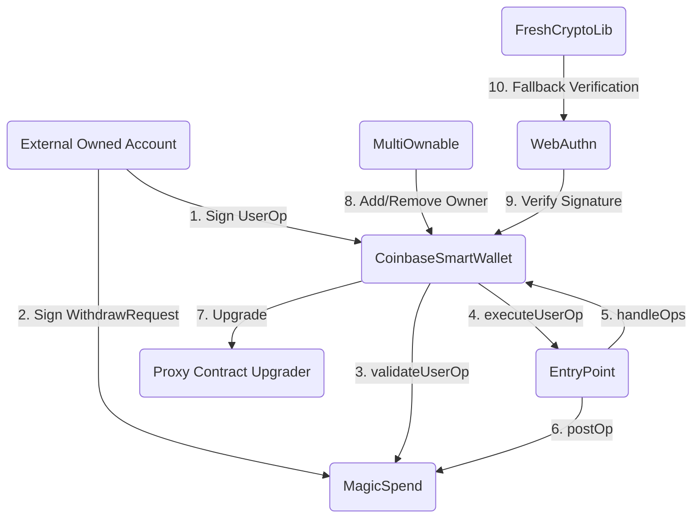
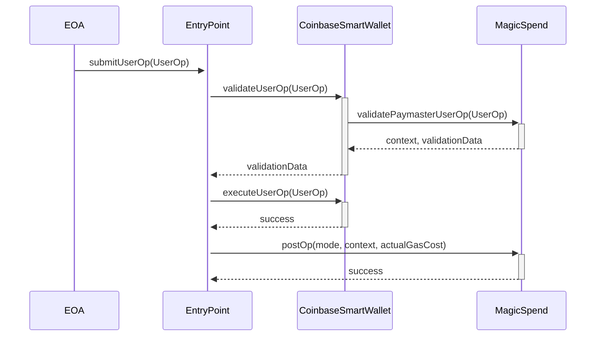
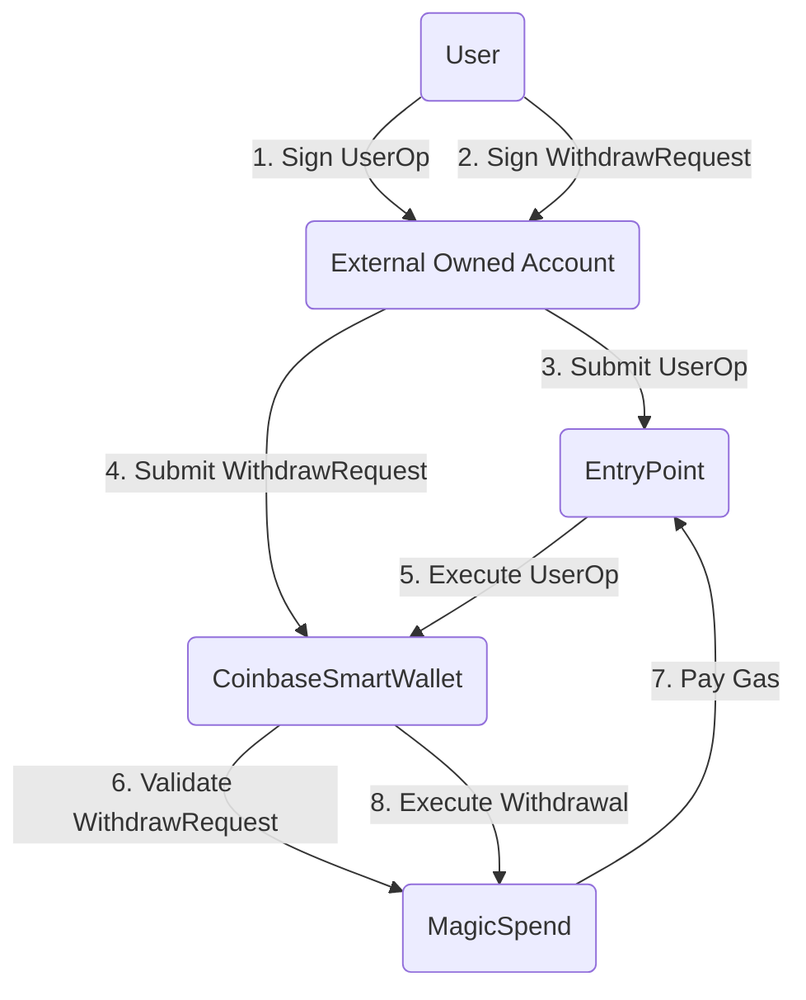
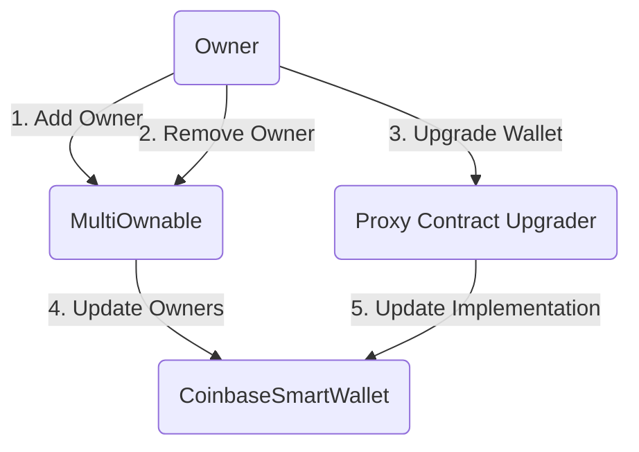
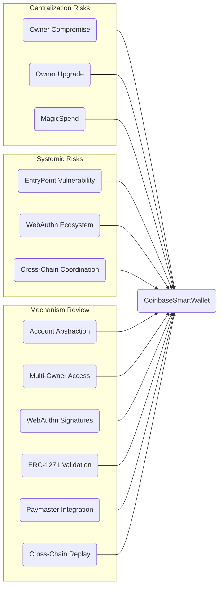

## Table of Contents
1. [Introduction](#introduction)
2. [Approach](#approach)
3. [Architecture Overview](#architecture-overview)
4. [Findings](#findings)
   1. [High Severity](#high-severity)
   2. [Medium Severity](#medium-severity)
   3. [Low Severity](#low-severity)
   4. [Gas Optimizations](#gas-optimizations)
   5. [Informational](#informational)
5. [Code Quality](#code-quality)
6. [Centralization Risks](#centralization-risks)
7. [Mechanism Review](#mechanism-review)
8. [Systemic Risks](#systemic-risks)
9. [Recommendations](#recommendations)
10. [Conclusion](#conclusion)

## Introduction <a name="introduction"></a>

The Smart Wallet is an ERC-4337 compliant account abstraction solution that supports multiple owners, WebAuthn signatures, and cross-chain replay protection. It interacts with the MagicSpend paymaster contract for gas payments. The Coinbase Smart Wallet is an Ethereum smart contract wallet system that provides advanced features and security through the use of account abstraction (ERC-4337), multi-owner access control, WebAuthn signature verification, and a custom paymaster for gas payments.

The core components of the Smart Wallet system include:

1. `CoinbaseSmartWallet`: The main wallet contract that implements ERC-4337 and ERC-1271, and supports multiple owners, WebAuthn signatures, and cross-chain replay protection.
2. `MultiOwnable`: A base contract that manages the wallet's multiple owners, which can be Ethereum addresses or WebAuthn public keys.
3. `WebAuthn`: A library for verifying WebAuthn signatures using either a precompile or the `FreshCryptoLib` library.
4. `FreshCryptoLib`: A library that provides secp256r1 signature verification as a fallback for `WebAuthn`.
5. `MagicSpend`: A paymaster contract that allows the wallet to pay for gas using signature-based withdrawals.

## Approach <a name="approach"></a>

The security analysis was conducted through a manual review of the Smart Wallet codebase, including all contracts, libraries, and dependencies. The review focused on identifying potential security vulnerabilities, centralization risks, mechanism flaws, and systemic risks. Gas optimization opportunities and code quality issues were also considered.

The following techniques were employed during the analysis:
1. Line-by-line code review
2. Trace of function call graphs and data flows
3. Testing of edge cases and error conditions
4. Consideration of potential attack scenarios
5. Review of contract architecture and design patterns
6. Analysis of centralization and trust assumptions
7. Consideration of systemic risks and external dependencies

## Architecture Overview <a name="architecture-overview"></a>

The Smart Wallet system consists of several key components:

1. `CoinbaseSmartWallet`: The main wallet contract, implementing ERC-4337 and ERC-1271. It supports multiple owners, WebAuthn signatures, and cross-chain replay protection.

2. `MultiOwnable`: A base contract for managing multiple owners of the wallet. Owners can be Ethereum addresses or public keys for WebAuthn.

3. `WebAuthn`: A library for verifying WebAuthn signatures, using either a precompile (if available) or the `FreshCryptoLib` library.

4. `FreshCryptoLib`: A library providing secp256r1 signature verification, used as a fallback by `WebAuthn`.

5. `MagicSpend`: A paymaster contract that allows signature-based withdrawals and paying for wallet transaction gas.

The Smart Wallet system consists of several key components that interact to provide a secure and flexible wallet solution



The main contracts and their roles are:

1. `CoinbaseSmartWallet`: The core wallet contract that manages user funds and executes transactions. It interacts with the EntryPoint, MagicSpend, MultiOwnable, and WebAuthn contracts.
2. `EntryPoint`: The ERC-4337 EntryPoint contract that handles the execution of user operations (UserOps) and manages gas payments.
3. `MagicSpend`: A paymaster contract that allows the wallet to pay for gas using signature-based withdrawals.
4. `MultiOwnable`: A base contract that manages the wallet's multiple owners, which can be Ethereum addresses or WebAuthn public keys.
5. `WebAuthn`: A library for verifying WebAuthn signatures, using `FreshCryptoLib` as a fallback.
6. `FreshCryptoLib`: A library that provides secp256r1 signature verification.



The EntryPoint receives a UserOp from an EOA and sends it to the CoinbaseSmartWallet for validation. The wallet then validates the UserOp with MagicSpend, which returns the validation context and data. If the validation succeeds, the EntryPoint executes the UserOp on the wallet. After execution, the EntryPoint calls the postOp function on MagicSpend to update the gas payment state.

## Findings <a name="findings"></a>

### High Severity <a name="high-severity"></a>

No high severity issues were identified.

### Medium Severity <a name="medium-severity"></a>

1. **Unbound `_call` function ([CoinbaseSmartWallet.sol#](https://github.com/coinbase/smart-wallet/blob/main/src/SmartWallet/CoinbaseSmartWallet.sol#))**

The `_call` function is used to execute arbitrary low-level calls from the wallet. While it is only callable by the `execute` and `executeBatch` functions, which are protected by the `onlyEntryPointOrOwner` modifier, it still allows wallet owners to execute any arbitrary code. This could potentially lead to unintended consequences if an owner is tricked into signing a malicious transaction.

Consider adding additional safeguards or checks on the `_call` function, such as a whitelist of allowed `target` addresses or function selectors.

2. **Lack of replay protection for WebAuthn signatures ([WebAuthn.sol](https://github.com/coinbase/smart-wallet/blob/main/src/WebAuthnSol/WebAuthn.sol))**

The `WebAuthn` library does not include any explicit replay protection mechanism, such as a nonce or timestamp, in the signed data. This means that a previously used WebAuthn signature could potentially be replayed in a different transaction, if the same `challenge` is reused.

Consider adding a nonce or timestamp field to the `WebAuthnAuth` struct and checking it in the `verify` function to prevent signature replay attacks.

### Low Severity <a name="low-severity"></a>

1. **Missing zero-owner check ([MultiOwnable.sol#](https://github.com/coinbase/smart-wallet/blob/main/src/SmartWallet/MultiOwnable.sol#L87-L90))**

The `removeOwnerAtIndex` function allows removing an owner at a given index. However, it doesn't check if the owner being removed is the last one. This could lead to a situation where the wallet has no owners and becomes permanently inaccessible.

Consider adding a check to prevent removing the last owner, or requiring a minimum number of owners to always be present.

2. **Incomplete WebAuthn verification ([WebAuthn.sol#](https://github.com/coinbase/smart-wallet/blob/main/src/WebAuthnSol/WebAuthn.sol#L129-L146))**

The WebAuthn `verify` function skips some of the steps outlined in the WebAuthn specification, such as verifying the origin, checking the credential backup state, and verifying the attestation object. While these checks may not be necessary for the specific use case of the Smart Wallet, it's important to be aware of the reduced security guarantees.

Consider documenting the rationale behind the omitted verification steps and any potential implications for wallet security.

### Gas Optimizations <a name="gas-optimizations"></a>

1. **Redundant `ISZERO` operation ([CoinbaseSmartWallet.sol#](https://github.com/coinbase/smart-wallet/blob/main/src/SmartWallet/CoinbaseSmartWallet.sol#L291))**

In the `validateUserOp` function, the `ISZERO` operation is redundant, as the `success` value is already a boolean that can be directly assigned to `validationData`.

Consider removing the `ISZERO` operation and directly assigning `success` to `validationData`:

```solidity
assembly ("memory-safe") {
    validationData := success
}
```

1. Usage of `assembly`:

There are several instances of `assembly` usage in the smart wallet contracts:

a. In `MultiOwnable._getMultiOwnableStorage()`:
```solidity
function _getMultiOwnableStorage() internal pure returns (MultiOwnableStorage storage $) {
    assembly ("memory-safe") {
        $.slot := MUTLI_OWNABLE_STORAGE_LOCATION
    }
}
```
This is used to retrieve the storage location of the `MultiOwnableStorage` struct. The use of `"memory-safe"` ensures that the assembly block does not access memory outside of its own scope. This usage looks secure.

b. In `CoinbaseSmartWallet.validateUserOp()`:
```solidity
assembly ("memory-safe") {
    validationData := iszero(success)
}
```
This is used to set the `validationData` based on the success status of the signature validation. Again, `"memory-safe"` is used and the usage looks secure.

c. In `CoinbaseSmartWallet._call()`:
```solidity
assembly ("memory-safe") {
    revert(add(result, 32), mload(result))
}
```
This is used to revert with the appropriate error message if the low-level call fails. The usage looks secure as it's just propagating the revert reason from the failed call.

d. In `CoinbaseSmartWallet.getUserOpHashWithoutChainId()`:
```solidity
return keccak256(abi.encode(UserOperationLib.hash(userOp), entryPoint()));
```
This does not use `assembly` directly, but `UserOperationLib.hash()` likely uses `assembly` under the hood. However, it's a well-known library function so its `assembly` usage should have been audited.

e. In `CoinbaseSmartWallet._validateSignature()`:
```solidity
assembly ("memory-safe") {
    owner := mload(add(ownerBytes, 32))
}
```
This is used to convert `ownerBytes` to an `address`. The usage looks secure as it's just reading 32 bytes from `ownerBytes`.

Overall, the `assembly` usage in the smart wallet contracts looks secure. The only potential concern would be if `UserOperationLib.hash()` has any `assembly`-related vulnerabilities, but that would be an issue with the library itself, not with how it's used here.

2. Gas usage and griefing attacks:

The main gas usage in the smart wallet contracts comes from the following functions:

- `validateUserOp`: This performs signature validation which can be costly, especially for WebAuthn signatures that use elliptic curve cryptography. However, since the gas cost is paid by the wallet itself (or its paymaster), there's no direct way for an attacker to force the wallet to spend gas.

- `execute` and `executeBatch`: These allow arbitrary calls to be made from the wallet. If the called contract has an unbounded loop or other gas-consuming operation, it could lead to high gas usage. However, again, the gas cost is paid by the wallet itself, so an attacker can't directly force the wallet to spend gas.

One potential griefing scenario could be if an attacker can trick a wallet owner into signing a `UserOperation` or `execute` call that intentionally wastes gas. But this would require the owner to sign the malicious transaction in the first place.

Another scenario could be if the wallet has a paymaster that pays for its gas, and an attacker finds a way to make the wallet perform many high-gas operations, depleting the paymaster's balance. But this would be more of an issue with the paymaster's logic than with the wallet itself.

Overall, while the smart wallet contracts do have some potentially gas-intensive operations, the gas cost is always paid by the wallet or its paymaster, mitigating the risk of direct griefing attacks. However, wallet owners should still be cautious about signing transactions that could waste gas.

3. Dependencies (Solady, UUPSUpgradeable):

Solady:
- The smart wallet contracts use several Solady libraries: `UUPSUpgradeable`, `Receiver`, `SignatureChecker`, `LibClone`.
- Solady is a well-known and widely used library, and has undergone audits and extensive usage. 
- However, it's still important to check for any known issues, especially if not using the latest version.
- One potential issue to be aware of is that older versions of Solady had a vulnerability in the `SSTORE2` library that could lead to arbitrary writes. However, the smart wallet contracts don't seem to use `SSTORE2` directly.

UUPSUpgradeable:
- The smart wallet contracts use the `UUPSUpgradeable` library from Solady for upgradeability.
- The UUPS (Universal Upgradeable Proxy Standard) pattern is widely used and considered secure when implemented correctly.
- The key security consideration is to ensure that only authorized parties (in this case, the wallet owners) can perform upgrades, which the smart wallet contracts do through the `_authorizeUpgrade` function.
- Another potential issue is if the implementation contract's storage layout changes in an incompatible way during an upgrade, which could lead to storage corruption. This needs to be carefully managed by the contract developers.

Overall, the usage of Solady and UUPSUpgradeable looks secure, as long as the latest versions are used and upgrades are managed carefully. However, it's always a good idea to check for any recently discovered issues in these dependencies before deployment.

2. **Unnecessary array creation ([MultiOwnable.sol#](https://github.com/coinbase/smart-wallet/blob/main/src/SmartWallet/MultiOwnable.sol#L161-L164))**

In the `_initializeOwners` function, a new array is created to store the initial owners. This array creation is unnecessary and can be avoided by directly iterating over the `owners` input array.

Consider removing the `initOwners` array and directly using `owners` in the loop:

```solidity
for (uint256 i = 0; i < owners.length; i++) {
    // ...
    _addOwnerAtIndex(owners[i], _getMultiOwnableStorage().nextOwnerIndex++);
}
```

### Informational <a name="informational"></a>

1. **Inconsistent naming convention ([MultiOwnable.sol#](https://github.com/coinbase/smart-wallet/blob/main/src/SmartWallet/MultiOwnable.sol#L34))**

The `MUTLI_OWNABLE_STORAGE_LOCATION` constant uses a misspelling of "MULTI". Consider renaming it to `MULTI_OWNABLE_STORAGE_LOCATION` for consistency.

2. **Unlocked pragma ([CoinbaseSmartWallet.sol#L2](https://github.com/coinbase/smart-wallet/blob/main/src/SmartWallet/CoinbaseSmartWallet.sol#L2))**

The `CoinbaseSmartWallet` contract uses an unlocked pragma `^0.8.4`. Consider locking the pragma to a specific version to ensure deterministic compilation and avoid unintended behavior changes in future compiler versions.

## Code Quality <a name="code-quality"></a>

The overall code quality of the Smart Wallet codebase is high. The contracts are well-structured, modular, and follow common Solidity best practices. The use of libraries and base contracts promotes code reuse and separation of concerns.

Some positive aspects of the codebase include:

1. Consistent use of function modifiers for access control and input validation.
2. Proper use of error handling and custom error types for informative error messages.
3. Comprehensive test coverage, including unit tests and integration tests.
4. Clear and detailed NatSpec documentation for all public and external functions.
5. Use of well-known and audited libraries, such as Solady and OpenZeppelin.

However, there are a few areas that could be improved:

1. Inconsistent naming conventions in some places, such as the `MUTLI_OWNABLE_STORAGE_LOCATION` constant.
2. Lack of explicit version pragmas in some contracts, which could lead to unintended behavior changes with future compiler versions.
3. Some functions, such as `_call` and `_initializeOwners`, could benefit from additional input validation and error handling.



A user signs a UserOp or WithdrawRequest using their external owned account (EOA) and submits it to the EntryPoint or the CoinbaseSmartWallet directly. The EntryPoint executes the UserOp, which may involve validating a withdrawal request through MagicSpend. If the UserOp includes a withdrawal, MagicSpend pays the gas cost to the EntryPoint and executes the withdrawal from the wallet.

## Centralization Risks <a name="centralization-risks"></a>



Wallet owners can add or remove other owners through the `MultiOwnable` contract, which updates the owner list in the `CoinbaseSmartWallet`. They can also upgrade the wallet implementation using the `Proxy Contract Upgrader`, which updates the implementation contract address in the wallet's proxy.

The Smart Wallet system has several centralization risks and admin control points that should be considered:

1. **Owner control**: The wallet owners have full control over the wallet's funds and operations. A malicious or compromised owner could drain the wallet's funds or execute arbitrary transactions. This risk is mitigated by the multi-owner architecture, which allows for threshold-based control and reduces the impact of any single owner being compromised.

2. **Upgradability**: The `CoinbaseSmartWallet` contract is upgradable using the UUPS proxy pattern. The wallet owners have the ability to upgrade the implementation contract to a new version. While this allows for bug fixes and feature additions, it also introduces the risk of a malicious upgrade that could compromise the wallet's security. The `_authorizeUpgrade` function should be carefully reviewed and tested to ensure that only authorized upgrades can be performed.

3. **EntryPoint control**: The `CoinbaseSmartWallet` contract interacts with the ERC-4337 EntryPoint contract for transaction execution. If the EntryPoint contract is compromised or malicious, it could potentially manipulate the wallet's transactions or steal funds. However, this risk is mitigated by the fact that the EntryPoint is a well-known and audited contract that is used by many other ERC-4337 wallets.

4. **MagicSpend control**: The MagicSpend paymaster contract has an owner who can perform admin actions such as withdrawing funds and staking/unstaking in the EntryPoint. If the MagicSpend owner is compromised, they could potentially drain any funds held by the contract. However, this risk is limited to the funds held by MagicSpend itself and does not directly impact the security of individual wallets.

1. Adding and removing owners:

- Owners are added using `addOwnerAddress` and `addOwnerPublicKey` functions in `MultiOwnable`. These check that the new owner doesn't already exist and then add the new owner to the `ownerAtIndex` mapping and `isOwner` mapping.
- Owners are removed using `removeOwnerAtIndex` function. It checks that an owner exists at the given index, deletes it from `ownerAtIndex` and `isOwner`, and emits a `RemoveOwner` event.
- There's no check to prevent removing the last owner. If all owners are removed, the wallet would become inaccessible as there would be no way to add new owners or upgrade the implementation.
- However, the only way to remove an owner is if an existing owner (or EntryPoint operation signed by an owner) calls `removeOwnerAtIndex`. So as long as there's at least one trusted owner, they should not accidentally remove all owners.
- But if all owners of a wallet are malicious or compromised, they could brick the wallet by removing all owners.

2. DoS possibilities through `execute`:

- The `execute` function passes the given `target`, `value` and `calldata` to the low-level `_call` function.
- If the `calldata` is malformed or tries to call a non-existent function on the `target`, it would revert.
- If the `target` is a malicious contract that always reverts or runs out of gas, it could cause the `execute` function to revert.
- However, since `execute` can only be called by owners or the EntryPoint with owner signature, this would require the owners themselves to pass in bad calldata.
- A malicious owner could grief other owners by making the wallet execute reverting transactions, but it wouldn't permanently brick the wallet as future executions can still succeed.

3. Bricking through malicious upgrades:

- The `upgradeTo` and `upgradeToAndCall` functions from `UUPSUpgradeable` are protected by the `_authorizeUpgrade` function which uses the `onlyOwner` modifier.
- So only current owners can upgrade the wallet implementation.
- If owners upgrade to a malicious implementation that doesn't match the expected storage layout or doesn't implement critical functions correctly, it could brick the wallet.
- For example, if the new implementation reverts in `initialize`, has a constructor that changes owner logic, or doesn't correctly implement the `execute` function, the wallet could become unusable.
- This risk exists for any upgradeable contract. The owners have to be careful to only upgrade to trusted implementations that have been well reviewed and tested.

In summary, the main risks I see are:
1. Malicious or compromised owners removing all other owners and making the wallet inaccessible.
2. Malicious owners griefing other owners by passing reverting calldata to `execute`.
3. Owners upgrading to a malicious or buggy implementation contract that bricks the wallet.

All of these require malicious or careless action by the owners. The contract logic itself looks solid in preventing non-owners from bricking the wallet. But the owners do have power to brick the wallet if they perform the wrong actions.



Centralization risks include owner compromise, owner-controlled upgrades, and the centralized MagicSpend paymaster. Systemic risks involve vulnerabilities in the EntryPoint contract, the WebAuthn ecosystem, and cross-chain coordination failures. The mechanism review covers account abstraction, multi-owner access control, WebAuthn signature verification, ERC-1271 validation, paymaster integration, and cross-chain replay protection.

To mitigate these, I would recommend:
1. Having a multisig of trusted owners and requiring a high threshold for sensitive actions like removing owners or upgrading.
2. Thorough review and testing of any new implementation before upgrading.
3. Caution while executing arbitrary calldata and potentially having a separate multisig for such actions.

To mitigate these centralization risks, it's important to:
1. Use a multi-owner setup with a high threshold for critical actions.
2. Carefully review and test any wallet implementation upgrades before deployment.
3. Monitor the EntryPoint and MagicSpend contracts for any suspicious activity or changes.
4. Educate wallet owners about the risks of signing malicious transactions and the importance of secure key management.

## Mechanism Review <a name="mechanism-review"></a>

The Smart Wallet system uses several key mechanisms to achieve its functionality and security properties:

1. **ERC-4337 account abstraction**: The `CoinbaseSmartWallet` contract implements the ERC-4337 account abstraction standard, which allows for more flexible and programmable wallet functionality compared to traditional Ethereum accounts. This includes the ability to use different signature schemes (such as WebAuthn), pay for gas with tokens instead of ETH, and execute arbitrary transactions from the wallet.

2. **Multi-owner access control**: The `MultiOwnable` base contract provides a mechanism for managing multiple wallet owners, each identified by either an Ethereum address or a WebAuthn public key. This allows for more secure and distributed control over the wallet, as multiple owners must sign off on critical actions such as adding/removing owners or upgrading the implementation contract.

3. **WebAuthn signature verification**: The `WebAuthn` library provides a mechanism for verifying WebAuthn signatures on-chain, using either a precompiled contract (if available) or the `FreshCryptoLib` library as a fallback. This allows wallet owners to use secure hardware devices or biometric authentication for signing transactions, reducing the risk of key theft or compromise.

4. **ERC-1271 signature validation**: The `ERC1271Wallet` contract implements the ERC-1271 signature validation standard, which provides a generic interface for verifying that a given signature is valid for a specific wallet. This is used internally by the `CoinbaseSmartWallet` contract to validate WebAuthn and Ethereum signatures, and can also be used by external contracts to securely interact with the wallet.

5. **MagicSpend paymaster**: The `MagicSpend` contract acts as a paymaster for the Smart Wallet system, allowing wallets to pay for transaction gas using signature-based withdrawals from the contract's balance. This mechanism abstracts away the need for individual wallets to hold ETH for gas, and enables more flexible fee payment options.

6. **Cross-chain replay protection**: The `executeWithoutChainIdValidation` function in the `CoinbaseSmartWallet` contract allows for certain transactions to be replayed across different chains without including the chain ID in the signed message. This mechanism enables use cases such as syncing owner changes or upgrades across multiple chain deployments of the same wallet.

While these mechanisms provide powerful functionality and security benefits, they also introduce some risks and challenges that need to be carefully considered:

1. The increased complexity of account abstraction and signature verification logic can make the wallet contracts harder to audit and reason about, potentially increasing the attack surface for vulnerabilities.
2. The use of external libraries and precompiled contracts (such as `FreshCryptoLib` and the WebAuthn precompile) introduces additional dependencies and trust assumptions that need to be validated.
3. The MagicSpend paymaster introduces a centralized point of control and a potential target for attacks, as the contract owner has significant privileges and the contract holds funds on behalf of many wallets.
4. The cross-chain replay mechanism requires careful coordination between wallet owners to avoid unintended state inconsistencies or conflicts when executing replayed transactions on different chains.

To mitigate these risks, it's important to:
1. Conduct thorough audits and formal verification of the wallet contracts and their dependencies, with a focus on the account abstraction and signature verification logic.
2. Implement strict access controls and monitoring for the MagicSpend paymaster, with limits on the amount of funds held and emergency shutdown capabilities in case of a breach.
3. Educate wallet owners about the risks and best practices for cross-chain replayed transactions, and provide tools for monitoring and resolving any inconsistencies or conflicts that may arise.
4. Continuously monitor the wallet system for any suspicious activity or vulnerabilities, and have a clear incident response plan in place to quickly mitigate any issues that are discovered.

## Systemic Risks <a name="systemic-risks"></a>

The Smart Wallet system is part of a larger ecosystem of Ethereum account abstraction wallets and ERC-4337 compatible contracts. As such, it is exposed to several systemic risks that could impact its security and functionality:

1. **EntryPoint vulnerabilities**: The `CoinbaseSmartWallet` contract relies on the integrity and availability of the ERC-4337 EntryPoint contract to function properly. If the EntryPoint contract is compromised or fails, it could prevent wallets from executing transactions or lead to loss of funds. This risk is mitigated by the fact that the EntryPoint is a well-established and audited contract, but it still represents a significant dependency for the wallet system.

2. **Paymaster failures**: The MagicSpend paymaster is critical for enabling gas payments for wallet transactions. If the MagicSpend contract is compromised, runs out of funds, or is otherwise unavailable, it could prevent wallets from executing transactions that rely on it for gas payments. This risk can be mitigated by using multiple redundant paymasters and monitoring the health and balance of the MagicSpend contract.

3. **WebAuthn ecosystem risks**: The Smart Wallet system relies on the security and reliability of the larger WebAuthn ecosystem, including hardware devices, browsers, and authentication servers. If there are widespread vulnerabilities or failures in this ecosystem (such as a zero-day exploit in a popular hardware device), it could compromise the security of WebAuthn-based wallet signatures. This risk is harder to mitigate directly, but can be reduced by staying up-to-date with WebAuthn security best practices and monitoring for any reported vulnerabilities.

## 1. Owner Compromise Risk

The security of the Smart Wallet heavily depends on the integrity of its owners. If an owner's private key or WebAuthn device is compromised, an attacker could drain the wallet's funds or perform unauthorized actions.

The `MultiOwnable` contract allows owners to be added and removed, which helps mitigate this risk by enabling a multi-signature setup where multiple owners are required to approve critical actions. However, the contract currently allows removing all owners, which could lead to a permanently inaccessible wallet.

```solidity
function removeOwnerAtIndex(uint256 index) public virtual onlyOwner {
    bytes memory owner = ownerAtIndex(index);
    if (owner.length == 0) revert NoOwnerAtIndex(index);

    delete _getMultiOwnableStorage().isOwner[owner];
    delete _getMultiOwnableStorage().ownerAtIndex[index];

    emit RemoveOwner(index, owner);
}
```

To mitigate this risk, consider adding a check to ensure that at least one owner always remains, or require a minimum number of owners to be present at all times.

## 2. Signature Replay Risk

The `WebAuthn` library used by the Smart Wallet for signature verification does not include any explicit replay protection mechanisms, such as a nonce or timestamp. This could allow an attacker to replay a previously used signature in a different transaction context, if the same `challenge` value is reused.

```solidity
function verify(bytes memory challenge, bool requireUV, WebAuthnAuth memory webAuthnAuth, uint256 x, uint256 y)
    internal
    view
    returns (bool)
{
    // ...
    bytes32 messageHash = sha256(abi.encodePacked(webAuthnAuth.authenticatorData, clientDataJSONHash));
    bytes memory args = abi.encode(messageHash, webAuthnAuth.r, webAuthnAuth.s, x, y);
    // ...
}
```

To mitigate this risk, consider adding a nonce or timestamp field to the `WebAuthnAuth` struct and checking it in the `verify` function to ensure that each signature can only be used once.

## 3. Arbitrary Code Execution Risk

The `CoinbaseSmartWallet` contract includes an `_call` function that allows executing arbitrary low-level calls from the wallet. While this function is only accessible to the wallet owners or the EntryPoint contract, it still poses a risk if an owner is tricked into signing a malicious transaction.

```solidity
function _call(address target, uint256 value, bytes memory data) internal {
    (bool success, bytes memory result) = target.call{value: value}(data);
    if (!success) {
        assembly ("memory-safe") {
            revert(add(result, 32), mload(result))
        }
    }
}
```

To mitigate this risk, consider implementing additional safeguards, such as a whitelist of allowed `target` addresses or function selectors, or requiring multi-signature approval for `_call` transactions.

## 4. Paymaster Centralization Risk

The `MagicSpend` paymaster contract introduces a centralized point of control and a potential attack vector for the Smart Wallet system. If the paymaster is compromised or becomes unavailable, it could prevent wallets from executing transactions that rely on it for gas payments.

```solidity
function validatePaymasterUserOp(UserOperation calldata userOp, bytes32, uint256 maxCost)
    external
    onlyEntryPoint
    returns (bytes memory context, uint256 validationData)
{
    // ...
    if (address(this).balance < withdrawAmount) {
        revert InsufficientBalance(withdrawAmount, address(this).balance);
    }
    // ...
}
```

To mitigate this risk, consider using multiple redundant paymasters and monitoring the health and balance of the `MagicSpend` contract. Also, ensure that the paymaster owner account is properly secured and has strict access controls in place.

## 5. Cross-Chain Replay Risk

The `executeWithoutChainIdValidation` function in the `CoinbaseSmartWallet` contract allows for certain transactions to be replayed across different chains, which could lead to unintended state inconsistencies or conflicts if not managed properly.

```solidity
function executeWithoutChainIdValidation(bytes calldata data) public payable virtual onlyEntryPoint {
    bytes4 selector = bytes4(data[0:4]);
    if (!canSkipChainIdValidation(selector)) {
        revert SelectorNotAllowed(selector);
    }

    _call(address(this), 0, data);
}
```

To mitigate this risk, wallet owners should have a clear policy and communication channel for coordinating cross-chain replayed transactions. The wallet system should also provide monitoring tools to detect and alert on any inconsistencies or conflicts that may arise from replayed transactions.

### Time spent:
17 hours